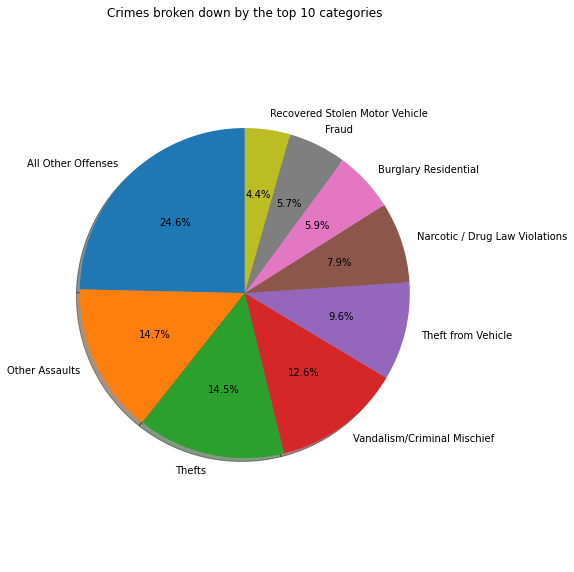
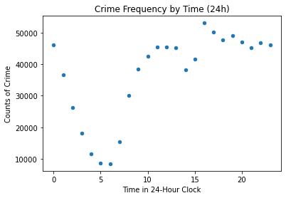

# **A Few Philadelphia Crime Trends**
### By Jefferson Leonata
##### Data is from 2006-2017 (Last update of dataset: 2017-03-23)
###### Data sourced from OpenDataPhilly
---

## **Why did I do this?**
#### * Practice with the concepts learned in my Python Lab.
#### * Show that you will not get killed in Philadelphia so please visit.


```python
import pandas as pd
import numpy as np
import matplotlib
import matplotlib.pyplot as plt
#Dependencies used + explaination:
#Pandas: Data handling
#Numpy: Data handling with Pandas
#Matplotlib: Plots
%matplotlib inline
```


```python
crime_stat = pd.read_csv("crime.csv")
```

---

## **What are the most frequent crimes committed?**


```python

```


```python
#-In this dataframe, we will count the 2017 data.
types_df = pd.DataFrame(crime_stat.Text_General_Code.value_counts().reset_index().values, columns=["Categories","Counts"])
types_df = types_df[:-23] #--Not an intuitive way but it gets the top 10 for the pie chart
fig1, ax1 = plt.subplots()
ax1.pie(types_df.Counts, explode=None, labels=types_df.Categories, autopct='%1.1f%%', shadow=True, startangle=90)

ax1.axis('equal')
bigger = plt.gcf()
bigger.set_size_inches(8,8) #--Increasing pie chart size for readability
plt.tight_layout() #--Prevents any text squishing
plt.title('Crimes broken down by the top 10 categories')
plt.show()
```





### **Top 10 crimes committed:**
#### 1. All Other Offenses
#### 2. Other Assaults
#### 3. Thefts
#### 4. Vandalism/Criminal Mischief
#### 5. Theft from Vehicle
#### 6. Narcotic/Drug Law Violations
#### 7. Fraud
#### 8. Recovered Stolen Motor Vehicle
#### 9. Burglary Residental
#### 10. Aggravated Assault: No Firearm

##### Note: None of the other offenses and other assaults include sexual assault and murder.
---

## **What are the most frequent times?**


```python
hour_df = types_df = pd.DataFrame(crime_stat.Hour.value_counts().reset_index().values, columns=["Hour","Counts"])

plt.scatter(hour_df.Hour, hour_df.Counts, s = 20)
plt.title('Crime Frequency by Time (24h)')
plt.xlabel('Time in 24-Hour Clock')
plt.ylabel('Counts of Crime')
plt.show()
```





```python
mostCrime = hour_df.Counts.max()
mostHour = hour_df[hour_df['Counts']==mostCrime].Hour.values
leastCrime = hour_df.Counts.min()
leastHour = hour_df[hour_df['Counts']==leastCrime].Hour.values

print(mostHour)
print(leastHour)
```

    [16.]
    [6.]
    

### *Most popular hour of the day for crime:* **16:00 or 4:00 PM**
### *Least popular hour of the day for crime:* **6:00 or 6:00 AM**
#### What a good reason for a morning run!
---
